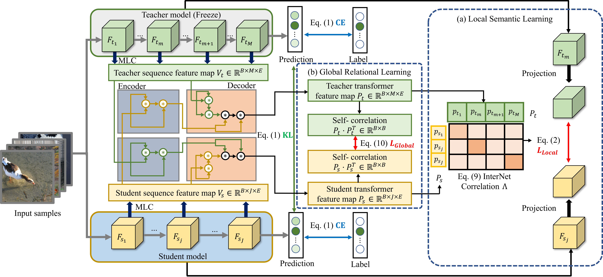
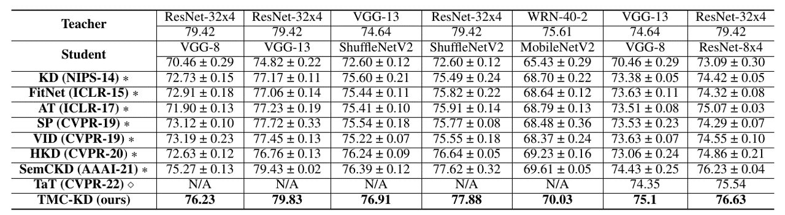
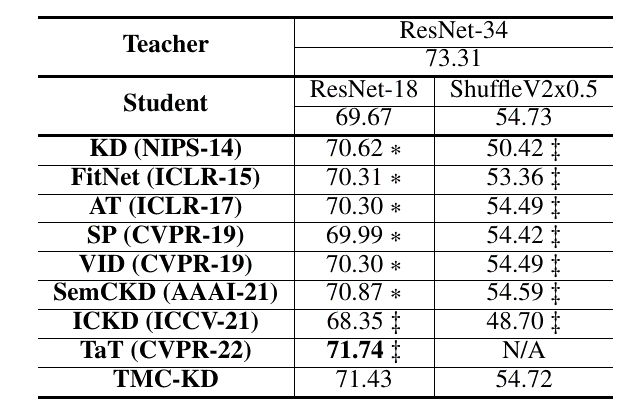

# TMC-KD : Bridging the Knowledge Gap via Transformer-based Multi-Layer Correlation Learning
-------------
A novel **transformer-based multi-layer correlation knowledge distillation (TMC-KD)** in order to bridge the knowledge gap between a pair of networks.
TMC-KD consist of **the multi-layer feautre converter (MLC), local semantic learning, and global relational learning**. 

# Results
-------------
## CIFAR-100

## ImageNet

