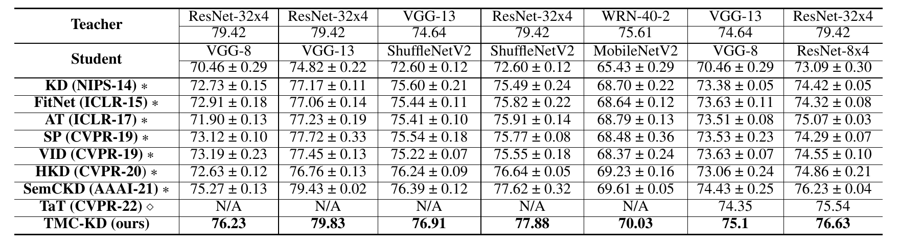

# TMC-KD : Bridging the Knowledge Gap via Transformer-based Multi-Layer Correlation Learning
A novel **transformer-based multi-layer correlation knowledge distillation (TMC-KD)** in order to bridge the knowledge gap between a pair of networks.
TMC-KD consist of **the multi-layer feautre converter (MLC), local semantic learning, and global relational learning**. 

# Results
## CIFAR-100

## ImageNet
|        Model        | ResNet-18 | ShuffleNetV2x0.5 |
|:-------------------:|:---------:|:----------------:|
| Teacher (ResNet-34) |   73.31   |       73.31      |
|       Student       |   69.67   |       54.73      |
|     KD (NIPS-14)    |   70.62   |      50.42       |
|   FitNet (ICLR-15)  |   70.31   |      53.46       |
|     AT (ICLR-17)    |   70.30   |      54.49       |
|     SP (CVPR-19)    |   69.99   |      54.42       |
|    VID (CVPR-19)    |   70.30   |      54.49       |
|   SemCKD (AAAI-21)  |   70.87   |      54.59       |
|    ICKD (ICCV-21)   |   68.35   |      48.70       |
|    TaT (CVPR-22)    |   71.74   |        N/A       |
|    TMC-KD (ours)    |   71.43   |      54.72       |
